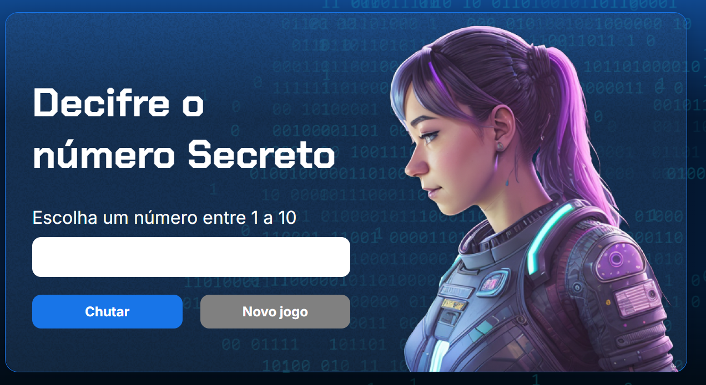

# 🔐 Decifre o Número Secreto

> Um jogo simples, divertido e viciante onde você precisa adivinhar o número secreto com base nas dicas dadas pelo sistema!

🎮 **Jogue agora:**  
👉 [https://numero-secreto-bice-chi.vercel.app](https://numero-secreto-bice-chi.vercel.app)

---

## 🧠 Como Jogar

1. O sistema escolhe aleatoriamente um número secreto.
2. Você digita palpites para tentar descobrir qual é.
3. A cada tentativa, o jogo indica se o número é **maior** ou **menor** que o seu palpite.
4. Continue tentando até acertar!

💡 Dica: Preste atenção nas pistas para otimizar suas tentativas.

---

## ✨ Funcionalidades

- Interface amigável e responsiva
- Feedback em tempo real
- Recomeço automático após acertar
- Totalmente gratuito e online!

---

## 🛠️ Tecnologias Utilizadas

- **HTML5**
- **CSS3**
- **JavaScript (Vanilla)**
- **Vercel** para deploy

---

## 📸 Preview

---
